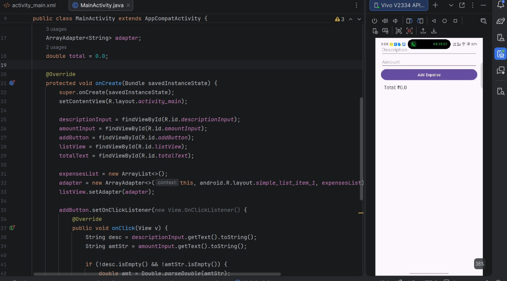

# 💰 Expense Tracker

A simple Android Expense Tracker application developed using **Java** in **Android Studio**. This app allows users to record daily expenses, view them in a list, and automatically calculate the total amount spent.

## 📱 Features

- ➕ Add new expenses with description and amount
- 📋 Display all added expenses in a list
- 💵 Automatically calculate the total expense
- 🧹 Clear input fields after adding an expense
- ⚠️ Input validation using Toast messages
- Simple and user-friendly interface

## 🛠️ Technologies Used

- Java
- Android Studio
- XML
- Android SDK
- ListView
- ArrayAdapter

## 🚀 How It Works

### Step 1
Enter the **Expense Description**.

Example:
```
Groceries
```

### Step 2
Enter the **Expense Amount**.

Example:
```
500
```

### Step 3
Click the **Add Expense** button.

The app will:

- Add the expense to the list.
- Update the total expense.
- Clear the input fields.

## 📸 Screenshot



## ▶️ Installation

1. Clone the repository

```bash
git clone https://github.com/kumaresh555/ExpenseTracker.git
```

2. Open the project in **Android Studio**.

3. Sync Gradle.

4. Run the application on an Android Emulator or Physical Device.

## 📋 Requirements

- Android Studio
- Android SDK
- Java 8 or above
- Android 5.0 (API 21) or higher

## 💡 Future Improvements

- Edit existing expenses
- Delete expenses
- Expense categories (Food, Travel, Shopping, etc.)
- Monthly and yearly expense reports
- Charts and analytics
- Local database using SQLite or Room
- Export expenses to PDF or Excel

## 👨‍💻 Author

Kumaresh S

Intern ID: CITS4419

GitHub: https://github.com/kumaresh555

## 📄 License

This project is developed for learning and educational purposes.
